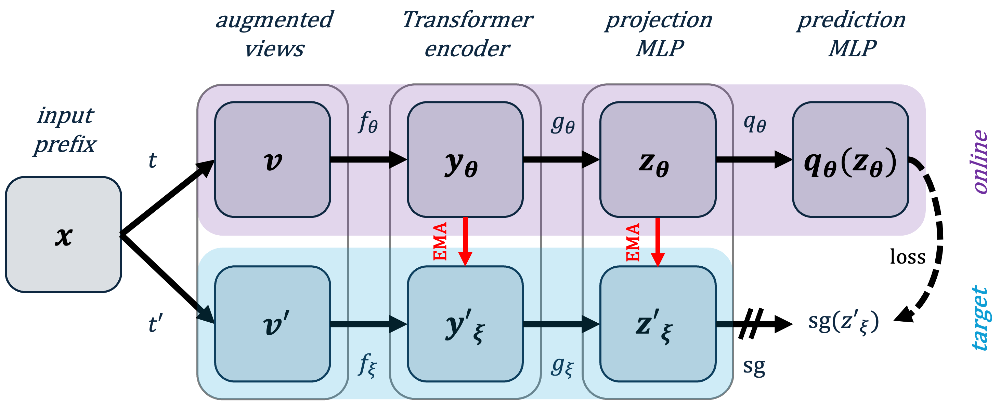

# SiamSA-PPM

This is the official GitHub repository for SIAMese learning with Statistical Augmentation for Predictive Process Monitoring (SiamSA-PPM).

[](https://arxiv.org/abs/2507.18293v1)




## Datasets

All the raw and preprocessed datasets can be downloaded from the following [Google Drive link](https://drive.google.com/drive/folders/1KH_tGC7SPEwpH0E9F0gZMLEbGOebnCn-?usp=share_link). After downloading, locate the folders in the main folder of your environment.


## Command-Line Arguments

This script accepts several command-line arguments:

```
--dataset | "sepsis" | Name of the dataset in lowercase letters. 
--STRATEGY | "combi" | Ours is named "combi", if you want to use only random augmentation use "random".

```

## **Command for Pre-Training**
```
python pretraining.py --dataName "sepsis"
```

## **Command for Training on Next Activity or Final Outcome Prediction**
```
python train_nap.py --dataName "sepsis"
```
```
python train_fop.py --dataName "sepsis"
```

## **Command for Evaluation on Next Activity or Final Outcome Prediction**
```
python eval_nap.py --dataName "sepsis"
```
```
python eval_fop.py --dataName "sepsis"
```
